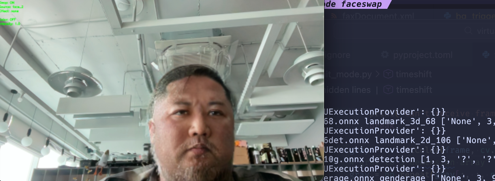
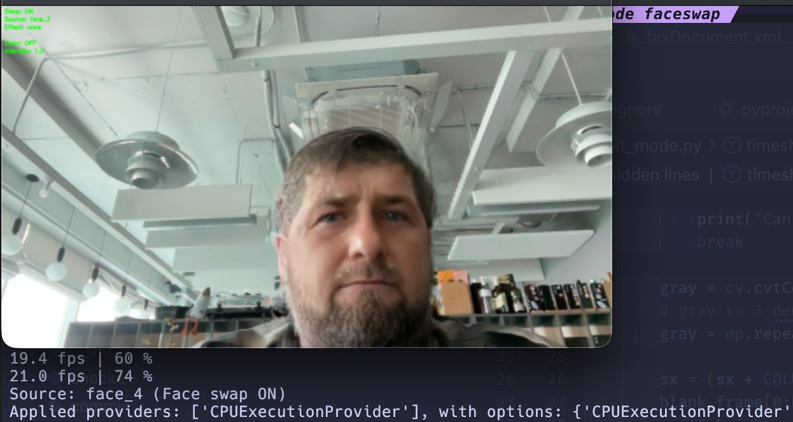

# FakeFaceCam

Приложение виртуальной камеры на Python, которое применяет к видеопотоку с веб-камеры эффекты в реальном времени и выводит его как виртуальное устройство камеры. Идеально подходит для стриминга, видеоконференций или творческих видеопроектов.

## Возможности

Приложение предоставляет несколько режимов обработки видео:

### 🎭 Matrix Mode
Превращает видеопоток в ASCII-арт в стиле "Матрицы" с падающими символами. Нажмите `m` для переключения между 5 подрежимами:
- Режим 0: Исходный кадр с ASCII-наложением
- Режим 1: ASCII с оригинальными цветами
- Режим 2: Зелёный ASCII на основе яркости (по умолчанию)
- Режим 3: Скроллирующиеся зелёные символы
- Режим 4: Случайные зелёные символы

### 👤 Face Mode
Обнаруживает и выделяет лица в реальном времени с помощью классификаторов Haar cascade. Рисует зелёные прямоугольники вокруг обнаруженных лиц с красными точками в центре.

### 📹 Raw Mode
Пропускает исходный видеопоток без обработки. Полезен для тестирования настройки виртуальной камеры.

### ⏱️ Timeshift Mode
Создаёт эффект временного сдвига, захватывая и отображая столбцы видеопотока по мере их перемещения по экрану.

### 🔄 Face Swap Mode
Заменяет лицо с камеры на выбранное исходное лицо с помощью InsightFace. Поддерживает:
- Выбор из нескольких исходных лиц из папки `resources/`
- Режим без замены лица для применения эффектов на исходное видео
- Эффекты: sharpen, cartoon, vignette, pixelate, edge detection, hue shift
- Регулировку интенсивности эффектов
- Оверлей с выбранным лицом

## Установка

### Требования
- Python 3.13
- [uv](https://github.com/astral-sh/uv) — быстрый менеджер пакетов Python
- Рабочая веб-камера
- Драйвер виртуальной камеры (в зависимости от ОС):
  - **macOS**: OBS Virtual Camera (встроен в OBS Studio)
  - **Linux**: v4l2loopback
  - **Windows**: OBS Virtual Camera

### Установка uv

Если у вас ещё не установлен uv, выполните:

```bash
# macOS / Linux
curl -LsSf https://astral.sh/uv/install.sh | sh

# Windows
powershell -c "irm https://astral.sh/uv/install.ps1 | iex"
```

### Настройка проекта

1. Склонируйте репозиторий:
```bash
git clone <repository-url>
cd fake_face_cam
```

2. Установите зависимости с помощью uv:
```bash
uv sync
```

Эта команда автоматически создаст виртуальное окружение с Python 3.13 (как указано в [`.python-version`](.python-version:1)) и установит все зависимости из [`pyproject.toml`](pyproject.toml:1).

## Использование

Запустите приложение с помощью uv:

```bash
uv run python run.py --mode matrix    # ASCII-эффект Матрицы
uv run python run.py --mode face      # Обнаружение лиц
uv run python run.py --mode raw       # Исходный видеопоток
uv run python run.py --mode timeshift # Эффект временного сдвига
uv run python run.py --mode faceswap  # Замена лица
```

### Управление
- **Общие**: Нажмите `q` для выхода из любого режима
- **Matrix Mode**: Нажмите `m` для переключения подрежимов
- **Face Swap Mode**:
  - `0` - выключить замену лица (только эффекты)
  - `[ / ]` - выбор исходного лица (включает замену)
  - `e` - переключение эффекта
  - `+/-` - интенсивность эффекта
  - `7 / 8` - размер окна предпросмотра
  - `< / >` - производительность (пропуск кадров)
  - `c` - цветокоррекция
  - `b / B` - blend ratio
  - `s` - показать/скрыть оверлей с выбранным лицом

## Структура проекта

```
fake_face_cam/
├── modes/
│   ├── matrix_mode.py       # ASCII-эффект Матрицы
│   ├── face_mode.py         # Режим обнаружения лиц
│   ├── raw_mode.py          # Прямая передача с камеры
│   ├── timeshit_mode.py     # Эффект временного сдвига
│   ├── face_swap_mode.py    # Режим замены лица
│   └── old_swap/            # Устаревшая реализация замены лица
├── utils/
│   ├── face_analyzer.py     # Анализатор лиц на базе InsightFace
│   └── effects.py           # Визуальные эффекты
├── resources/
│   ├── models/              # Модели InsightFace (автозагрузка)
│   └── *.png                # Исходные лица для замены
├── run.py                   # Точка входа
├── utils.py                 # Вспомогательные функции
├── pyproject.toml           # Конфигурация проекта
├── uv.lock                  # Файл блокировки зависимостей uv
└── .python-version          # Версия Python для проекта (3.13)
```

## Конфигурация

Приложение использует веб-камеру по умолчанию (индекс 0) и автоматически определяет разрешение камеры. Виртуальная камера работает с частотой 20 FPS по умолчанию.

Для изменения устройства камеры или других настроек отредактируйте [`run.py`](run.py:22):

```python
cap = cv.VideoCapture(0)  # Измените 0 на индекс вашей камеры
fps = 20                  # Желаемое количество кадров в секунду
```

## Зависимости

Проект использует следующие зависимости (определены в [`pyproject.toml`](pyproject.toml:7)):

- **opencv-python** (>=4.13.0.90) — Компьютерное зрение и обработка изображений
- **pyvirtualcam** (>=0.15.0) — Вывод на виртуальную камеру
- **insightface** (>=0.7.3) — Детекция и замена лиц
- **onnxruntime** (>=1.16.0) — Выполнение моделей нейросетей
- **numpy** (>=1.24.0) — Работа с массивами и матрицами

## Face Swap Mode

### Подготовка исходных лиц

Для работы Face Swap Mode необходимы изображения лиц в формате PNG. Поместите их в папку `resources/`:

- Все PNG файлы из папки `resources/` будут автоматически загружены
- Файлы сортируются по имени

Требования к изображениям:
- Формат: PNG
- Разрешение: рекомендуется 512x512 или выше
- Лицо должно быть хорошо освещено и чётко видно
- Без сильных искажений или наклонов

### Использование

```bash
uv run python run.py --mode faceswap
```

При первом запуске автоматически загрузится модель `inswapper_128.onnx` (~529 МБ) из HuggingFace.

### Управление

- `0` — выключить замену лица (применяются только эффекты)
- `[ / ]` — выбор исходного лица (включает замену лица)
- `e` — переключение между эффектами (none, sharpen, cartoon, vignette, pixelate, edge, hue)
- `+/-` — регулировка интенсивности текущего эффекта (0.1 - 3.0)
- `7 / 8` — размер окна предпросмотра
- `< / >` — производительность (пропуск кадров)
- `c` — включить/выключить цветокоррекцию
- `b / B` — blend ratio (0 = выключено, 1.0 = полное смешивание)
- `s` — показать/скрыть оверлей с выбранным лицом
- `q` — выход из режима




### Оптимизация производительности

Face Swap Mode использует следующие оптимизации для работы на CPU:
- Детекция лиц выполняется каждые 2-3 кадра для экономии ресурсов
- Используется модель `buffalo_l` для качественного детектирования
- Кэширование загруженных моделей и исходных лиц

Для улучшения производительности:
- Используйте меньшее разрешение камеры
- Закройте другие ресурсоёмкие приложения
- Увеличьте параметр `skip_frames` клавишей `>`
- Уменьшите размер окна предпросмотра клавишей `7`

## Лицензия

Этот проект использует библиотеку pyvirtualcam. Подробности о реализации виртуальной камеры см. в [лицензии pyvirtualcam](https://github.com/letmaik/pyvirtualcam).

## Участие в разработке

Вклады приветствуются! Не стесняйтесь отправлять issues или pull requests.

## Устранение неполадок

### Виртуальная камера не обнаружена
- Убедитесь, что OBS Virtual Camera установлен и запущен
- В Linux убедитесь, что модуль v4l2loopback загружен: `sudo modprobe v4l2loopback`

### Камера не открывается
- Проверьте, что веб-камера не используется другим приложением
- Попробуйте изменить индекс камеры в [`run.py`](run.py:22)

### Обнаружение лиц не работает
- Обеспечьте хорошее освещение
- Классификатор Haar cascade может потребовать настройки для разных условий освещения

### Face Swap Mode не работает
- Убедитесь, что исходные изображения лиц находятся в папке `resources/`
- При первом запуске подождите загрузки модели `inswapper_128.onnx` (~100 МБ)
- Если замена лица не срабатывает, попробуйте увеличить освещение
- Для низкой производительности увеличьте параметр `skip_frames` в коде
- Проверьте, что на изображениях с исходными лицами хорошо видно лицо (детектируется)

### Ошибка при загрузке модели InsightFace
- Убедитесь, что папка `resources/models/` существует
- Проверьте подключение к интернету (для загрузки модели при первом запуске)
- Если загрузка прервалась, удалите частичный файл в `resources/models/` и перезапустите
